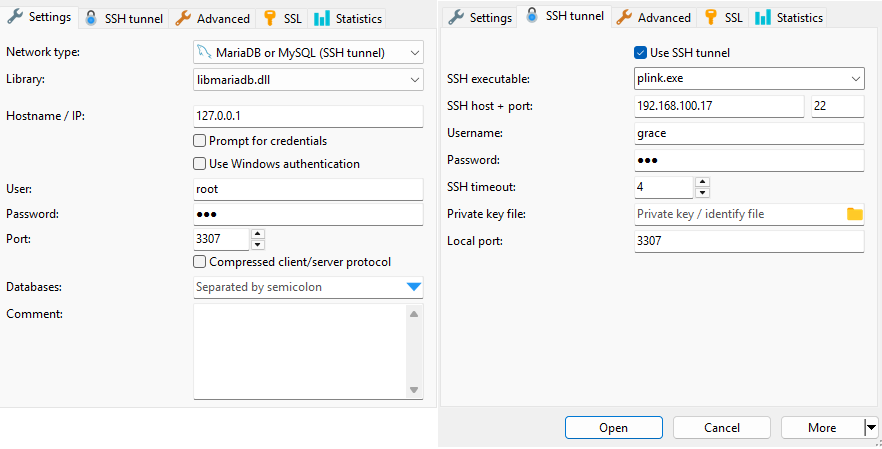

# 🚀 Production Deploy Guide - Master Gambar

Panduan lengkap deploy aplikasi Master Gambar ke server production.

**Server:** `192.168.100.17`  
**Aplikasi:** `~/laravel/master-gambar`

---

## 📋 Daftar Isi

1. [Pre-requisites](#1-pre-requisites)
2. [Clone Repository](#2-clone-repository)
3. [Konfigurasi Production](#3-konfigurasi-production)
4. [Build & Jalankan](#4-build--jalankan)
5. [Setup Auto-Start & Backup](#5-setup-auto-start--backup)
6. [Verifikasi](#6-verifikasi)
7. [Migrasi dari Laragon](#7-migrasi-dari-laragon)
8. [Update Aplikasi](#8-update-aplikasi)
9. [Troubleshooting](#9-troubleshooting)

---

## 1. Pre-requisites

Pastikan Docker sudah terinstall di server:

```bash
docker -v
docker compose -v
```

**Output yang diharapkan:**
```
Docker version 24.x.x, build xxxxxxx
Docker Compose version v2.x.x
```

---

## 2. Clone Repository

```bash
# Buat folder untuk aplikasi Laravel
mkdir -p ~/laravel
cd ~/laravel

# Clone repository
git clone https://github.com/Zenalghi/master-gambar.git

# Masuk ke folder project
cd ~/laravel/master-gambar
```

**Struktur folder:**
```
~/laravel/
└── master-gambar/
    ├── docker/
    │   ├── .env.secrets.example    # Template secrets (masuk Git)
    │   ├── .env.secrets            # Production secrets (gitignore)
    │   ├── nginx/
    │   ├── mysql/
    │   └── php/
    ├── docker-compose.yml           # Template (masuk Git)
    ├── docker-compose.prod.yml      # Production (gitignore)
    └── ...
```

---

## 3. Konfigurasi Production

### 3.1 Buat File Production

```bash
cd ~/laravel/master-gambar

# Copy template ke file production
cp docker-compose.yml docker-compose.prod.yml
cp docker/.env.secrets.example docker/.env.secrets
```

### 3.2 Edit Password & APP_URL

```bash
# Edit docker-compose.prod.yml
nano docker-compose.prod.yml

# Edit .env.secrets (password terpusat untuk semua script)
nano docker/.env.secrets

```

**File 2: `docker-compose.prod.yml`**

| Baris | Placeholder | Ganti Dengan |
|-------|-------------|--------------|
| 16 | `GANTI_PASSWORD_ROOT_DI_SINI` | Password root MySQL Anda (sama dengan .env.secrets) |
| 17 | `GANTI_PASSWORD_APP_DI_SINI` | Password app MySQL Anda (sama dengan .env.secrets) |
| 35 | `http://GANTI_IP_SERVER:8080` | `http://192.168.100.17:8080` |

**Contoh hasil edit:**
```yaml
x-passwords:
  root_password: &root_pass PasswordRootKuat123!
  app_password: &app_pass PasswordAppKuat456!

# ...

environment:
  APP_URL: http://192.168.100.17:8080
```

**File 1: `docker/.env.secrets` (FILE UTAMA - Password Terpusat)**

| Variable | Placeholder | Ganti Dengan |
|----------|-------------|--------------|
| `MYSQL_ROOT_PASSWORD` | `GANTI_PASSWORD_ROOT_DI_SINI` | Password root MySQL Anda |
| `MYSQL_APP_PASSWORD` | `GANTI_PASSWORD_APP_DI_SINI` | Password app MySQL Anda |

**Contoh hasil edit:**
```bash
# MySQL Root Password (sama dengan root_password di docker-compose.prod.yml)
MYSQL_ROOT_PASSWORD=PasswordRootKuat123!

# MySQL App Password (sama dengan app_password di docker-compose.prod.yml)
MYSQL_APP_PASSWORD=PasswordAppKuat456!

# Database Name
MYSQL_DATABASE=db_master

# Backup Configuration
BACKUP_DIR=/mnt/data/backups
RETENTION_DAYS=7
```

**Simpan:** `Ctrl+O` → `Enter` → `Ctrl+X`

### 📌 Mengapa Harus Copy?

```
┌─────────────────────────────────────────────────────────────────┐
│                                                                 │
│  Template (Git)              Production (Gitignore)             │
│  ─────────────               ──────────────────────             │
│                                                                 │
│  docker-compose.yml          docker-compose.prod.yml            │
│  - Placeholder password      - Password asli                    │
│  - Masuk ke Git              - DI-IGNORE oleh Git               │
│                                                                 │
│  docker/.env.secrets.example docker/.env.secrets                │
│  - Placeholder password      - Password asli (TERPUSAT)         │
│  - Masuk ke Git              - DI-IGNORE oleh Git               │
│                                                                 │
│  Setiap git pull:                                               │
│  - Template berubah → OK                                        │
│  - Production tetap → Password aman!                            │
│                                                                 │
└─────────────────────────────────────────────────────────────────┘
```

### 📌 Keuntungan Password Terpusat (.env.secrets)

```
┌─────────────────────────────────────────────────────────────────┐
│                                                                 │
│  SEBELUM (Password di banyak file):                             │
│  ──────────────────────────────────                             │
│  docker-compose.prod.yml  → edit password                       │
│  docker/mysql/backup.sh   → edit password                       │
│  docker/update-safe.sh    → edit password                       │
│                                                                 │
│  SESUDAH (Password di satu file):                               │
│  ────────────────────────────────                               │
│  docker/.env.secrets      → edit password SEKALI saja!          │
│                                                                 │
│  Semua script otomatis membaca dari .env.secrets                │
│                                                                 │
└─────────────────────────────────────────────────────────────────┘
```

---

## 4. Build & Jalankan

```bash
cd ~/laravel/master-gambar

# Build dan jalankan dengan file production
docker compose -f docker-compose.prod.yml up -d --build
```

**Proses build akan memakan waktu 5-15 menit**.

**Output yang diharapkan:**
```
[+] Building 120.0s (15/15) FINISHED
[+] Running 3/3
 ✔ Container master-gambar-mysql  Healthy
 ✔ Container master-gambar-app    Started
 ✔ Container master-gambar-nginx  Started
```

---

## 5. Setup Auto-Start & Backup

```bash
cd ~/laravel/master-gambar

# Jalankan script setup (butuh sudo, jalankan SEKALI saja)
sudo bash docker/setup-autostart.sh
```

**Script ini akan:**
- ✅ Mengaktifkan Docker auto-start saat boot
- ✅ Membuat script `docker/autobackup.sh` untuk backup otomatis
- ✅ Mengatur auto-backup jam 12:00 siang (database + storage)
- ✅ Backup disimpan di `/mnt/data/backups/`
- ✅ Auto-cleanup backup lama (retention 7 hari)
- ✅ Mengatur log rotation

**Verifikasi cron jobs:**
```bash
crontab -l
```

**Struktur backup:**
```
/mnt/data/backups/
└── 2024-01-15-12:00-master-autobackup/
    ├── mysql-backup-2024-01-15-120000.sql
    └── app/
        └── master/
            ├── file1.pdf
            ├── file2.png
            └── ...
```

---

## 6. Verifikasi

### 6.1 Cek Status Container

```bash
docker compose -f docker-compose.prod.yml ps
```

**Output yang diharapkan:**
```
NAME                    STATUS                   PORTS
master-gambar-app       Up 2 minutes (healthy)   9000/tcp
master-gambar-mysql     Up 2 minutes (healthy)   33060/tcp, 127.0.0.1:3307->3306/tcp
master-gambar-nginx     Up 2 minutes (healthy)   0.0.0.0:8080->80/tcp, [::]:8080->80/tcp
```

### 6.2 Test Aplikasi

```bash
curl -I http://localhost:8080
```

### 6.3 Test dari Browser

```
http://192.168.100.17:8080
```

---

## 7. Migrasi dari Laragon

Jika Anda sebelumnya menggunakan Laragon dan ingin memindahkan data ke Docker.

### 7.1 Backup Database dari Laragon (HeidiSQL)

```
Di HeidiSQL:
1. Connect ke Laragon MySQL (127.0.0.1:3306, user: root)
2. Pilih database db_master
3. Klik kanan → Export database as SQL
4. Pilih: Structure + Data
5. Simpan sebagai db_master.sql di ~/laravel/
```

### 7.2 Restore Database ke Docker

```bash
# Restore dari file SQL
cat ~/laravel/db_master.sql | docker exec -i master-gambar-mysql mysql -u root -p db_master

# Masukkan password MySQL Anda saat diminta
```

Atau Hunakan Heidisql dengan MariaDB or MySQSL sshtunnel



setelah masuk execute sql ke database

### 7.3 Copy Storage dari Laragon ke Docker

```bash
# Copy folder storage dari host ke container
docker cp ~/laravel/master-gambar/storage/app/master master-gambar-app:/var/www/html/storage/app/

# Kritis: Ubah permission agar Laravel bisa baca/tulis
docker exec -u root master-gambar-app chown -R www-data:www-data /var/www/html/storage/app/master
docker exec -u root master-gambar-app chmod -R 775 /var/www/html/storage/app/master
```

### 7.4 Verifikasi Migrasi

```bash
# Cek database
docker exec -it master-gambar-mysql mysql -u root -p -e "SHOW TABLES;" db_master

# Cek storage
docker exec master-gambar-app ls -lh /var/www/html/storage/app/
docker exec master-gambar-app ls -lh /var/www/html/storage/app/master/

# Test aplikasi
curl -I http://localhost:8080
```

---

## 8. Update Aplikasi

### ✅ Cara Update Aman (Menggunakan Script Otomatis)

Script `docker/update-safe.sh` akan melakukan backup otomatis database dan storage sebelum update, sehingga data Anda aman!

```bash
cd ~/laravel/master-gambar

# Jalankan script update aman (backup + update + rebuild)
bash docker/update-safe.sh
```

**Apa yang dilakukan script ini:**

1. **Backup Database** - Export semua database MySQL ke folder `/mnt/data/backups/`
2. **Backup Storage** - Copy semua file (PDF, PNG, ZIP) dari container ke host
3. **Pull Latest Code** - Download update terbaru dari Git
4. **Stop Containers** - Hentikan container (volume data TIDAK terhapus!)
5. **Rebuild Images** - Build ulang Docker images
6. **Start Containers** - Jalankan container kembali
7. **Verifikasi** - Cek status container

**Output yang diharapkan:**
```
==========================================
  Master Gambar - Safe Update
  2024-01-15 10:30:00
==========================================

[1/8] Backup database MySQL...
  ✓ Database backup selesai (150M)

[2/8] Backup storage (file PDF/PNG/ZIP)...
  ✓ Storage backup selesai (2.3G)

[3/8] Pull latest code dari Git...
  ✓ Code updated

[4/8] Stop containers...
  ✓ Containers stopped

[5/8] Rebuild Docker images...
  ✓ Images rebuilt

[6/8] Start containers...
  ✓ Containers started

[7/8] Backup database MySQL (Setelah Update)...
  ✓ Database backup (updated) selesai (150M)

[8/8] Verifikasi...
  ✓ Semua container running

==========================================
  Update Selesai!
==========================================
```

### 📌 Kenapa Aman?

```
┌─────────────────────────────────────────────────────────────────┐
│                                                                 │
│  Data yang AMAN (tidak terhapus):                               │
│  ────────────────────────────────                               │
│  ✓ MySQL database (volume: mysql-data)                          │
│  ✓ File storage (volume: storage-data)                          │
│  ✓ Backup database (volume: mysql-backup)                       │
│  ✓ Backup storage (folder: /mnt/data/backups/)                  │
│  ✓ Shared code (volume: app-code)                               │
│                                                                 │
│  Yang BERUBAH saat update:                                      │
│  ──────────────────────────                                     │
│  → Docker images (dibuild ulang)                                │
│  → Application code (git pull)                                  │
│                                                                 │
│  File production tetap AMAN:                                    │
│  ──────────────────────────                                     │
│  ✓ docker-compose.prod.yml (tidak berubah)                      │
│  ✓ docker/.env.secrets (tidak berubah)                          │
│                                                                 │
└─────────────────────────────────────────────────────────────────┘
```

### ⚠️ Catatan Penting

- Script akan otomatis mendeteksi dan menggunakan `docker-compose.prod.yml` jika tersedia. Jika tidak ada, script akan fallback ke `docker-compose.yml`.
- Pastikan `docker/.env.secrets` sudah dibuat sebelum menjalankan script
- Backup disimpan di folder `/mnt/data/backups/` dengan format tanggal
- Jika terjadi masalah, Anda bisa restore dari backup

### 🔄 Verifikasi Setelah Update

```bash
# Cek status container
docker compose -f docker-compose.prod.yml ps

# Cek logs jika ada masalah
docker compose -f docker-compose.prod.yml logs -f

# Test aplikasi
curl -I http://localhost:8080
```
---

## 9. Troubleshooting

| Masalah | Solusi |
|---------|--------|
| Container tidak start | `docker compose -f docker-compose.prod.yml logs app` |
| MySQL connection refused | Tunggu container mysql healthy |
| Port 8080 dipakai | Ubah port di `docker-compose.prod.yml` |
| Password salah | Edit `docker/.env.secrets` dan `docker-compose.prod.yml`, lalu restart |
| Backup gagal | Cek password di `docker/.env.secrets` sudah benar |
| Storage permission error | Jalankan `chown -R www-data:www-data /var/www/html/storage/app/` |
| Backup path salah | Pastikan `BACKUP_DIR` menggunakan path absolut, bukan `~` |

### 📌 Best Practice: Path Handling

**Masalah Umum dengan `~` (Tilde):**
- `~` di shell akan di-expand ke home directory user yang menjalankan script
- Tapi jika di-set sebagai variabel (misal `BACKUP_DIR=~/path`), `~` tidak akan di-expand
- Di dalam container, `~` merujuk ke home directory container, bukan host

**Solusi yang Digunakan:**
```bash
# Gunakan eval untuk resolve ~ ke path absolut
HOME_DIR=$(eval echo "~${USER}")
BACKUP_DIR="${BACKUP_DIR:-${HOME_DIR}/laravel/backups}"
```

**Semua script backup sudah menggunakan best practice ini:**
- `docker/autobackup.sh` - Auto-backup script
- `docker/update-safe.sh` - Safe update script
- `docker/backup-only-manual.sh` - Backup manual database dan storage script

---

## 📁 Struktur File

| File | Keterangan | Git |
|------|------------|-----|
| `docker-compose.yml` | Template dengan placeholder | ✅ Masuk |
| `docker-compose.prod.yml` | Production dengan password asli | ❌ Ignore |
| `docker/.env.secrets.example` | Template secrets dengan placeholder | ✅ Masuk |
| `docker/.env.secrets` | Production secrets dengan password asli | ❌ Ignore |
---

## 🔒 Security Checklist

- [ ] `docker/.env.secrets` sudah dibuat dan password sudah diganti
- [ ] `docker-compose.prod.yml` sudah dibuat dan password sudah diganti
- [ ] `docker/.env.secrets` ada di `.gitignore`
- [ ] `docker-compose.prod.yml` ada di `.gitignore`
- [ ] `APP_DEBUG=false` di `.env.docker.example`
- [ ] MySQL port hanya localhost (`127.0.0.1:3307`)
- [ ] Docker auto-start sudah di-enable
- [ ] Backup otomatis sudah di-setup

---

## 📊 Resource Usage

| Container | Memory Limit | CPU Limit |
|-----------|-------------|-----------|
| app (PHP-FPM) | 3 GB | 3.0 cores |
| nginx | 256 MB | 0.5 cores |
| mysql | 3 GB | 2.0 cores |

**Total:** ~6.25 GB RAM, ~5.5 cores

**Spesifikasi Server:**
- Intel i5 Gen 12 ✅
- RAM 16 GB ✅
